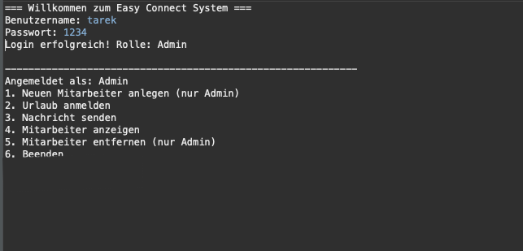

# Easy Connect System

## Overview

**Easy Connect System** is a simple Java-based console application designed to manage employees and internal communication within a company.

The project was developed as a learning exercise to practice **backend development concepts**, including database connectivity, layered architecture, and the DAO design pattern.

The system allows administrators to manage employees, send internal messages, and register vacations while storing data in a **MySQL database**.

This project demonstrates fundamental **Java enterprise development principles** such as structured architecture, database integration using JDBC, and clean code organization.

---

## Features

The system currently supports the following functionalities:

* User authentication (Admin / Employee)
* Employee management
* Add new employees
* View all employees
* Register employee vacations
* Send internal messages
* Soft delete for employees
* Persistent storage using MySQL database
* Structured backend architecture using DAO pattern

---

## Technologies Used

The project is implemented using the following technologies:

* **Java**
* **JDBC**
* **MySQL**
* **DAO Design Pattern**
* **Layered Architecture**
* **Eclipse IDE**
* **Git & GitHub**

---

## System Architecture

The project follows a simplified **layered architecture**, separating application logic from data access.

```
Application Layer
       ↓
Service Layer
       ↓
DAO Layer
       ↓
Database
```

This structure improves maintainability and reflects common backend architecture used in real-world enterprise applications.

---

## Project Structure

```
src
├── app
│   └── TestApp.java
│
├── dao
│   ├── DAO.java
│   ├── MitarbeiterDAO.java
│   └── MitarbeiterDAOImpl.java
│
├── model
│   ├── Arbeitgeber.java
│   ├── Mitarbeiter.java
│   ├── Schichtleiter.java
│   ├── Schichtplan.java
│   └── zustand.java
│
└── util
    └── Database.java
```

Description of important folders:

- **app** → Contains the main entry point of the application (TestApp.java), where the program starts and the console interaction is handled.

- **dao** → Contains the Data Access Objects responsible for database operations such as retrieving, inserting, updating, and deleting data using JDBC.

- **model** → Contains the domain classes representing the core entities of the system such as employees, employers, shift leaders, shift plans, and status definitions.

- **util** → Contains utility classes such as the database connection class used to establish and manage the connection to the MySQL database.
---

## Database

The system uses a MySQL database.

Database name:

```
easy_connect
```

Example table structure:

### Table: mitarbeiter

| Field                | Type    |
| -------------------- | ------- |
| id                   | INT     |
| name                 | VARCHAR |
| zustand              | VARCHAR |
| beschaeftigtBeiFirma | VARCHAR |
| message              | TEXT    |

---

## Application Screenshot

Example output from the console application:



---

## Installation

### 1. Clone the repository

```
git clone https://github.com/TarekMOBYED/easy-connect-system.git
```

### 2. Open the project in Eclipse

Import the project as a **Java Project**.

### 3. Configure the database

Create the database in MySQL:

```
CREATE DATABASE easy_connect;
```

Create the required tables.

### 4. Configure database connection

Update the connection parameters in:

```
util/Database.java
```

Example:

```
jdbc:mysql://localhost:3306/easy_connect
```

---

## Running the Application

Run the main class:

```
TestApp.java
```

The application will start in the console and display the available menu options.

---

## Example Usage

Example login:

```
Username: admin
Password: admin
```

Example console output:

```
=== Willkommen zum Easy Connect System ===
Benutzername: tarek
Passwort: 1234
Login erfolgreich! Rolle: Admin

------------------------------------------------------------
Angemeldet als: Admin
1. Neuen Mitarbeiter anlegen (nur Admin)
2. Urlaub anmelden
3. Nachricht senden
4. Mitarbeiter anzeigen
5. Mitarbeiter entfernen (nur Admin)
6. Beenden
```

---

## Learning Goals

This project was created to practice and understand:

* Object-Oriented Programming in Java
* JDBC database connectivity
* DAO design pattern
* Layered software architecture
* Basic enterprise backend structure
* Working with Git and GitHub
* Designing maintainable Java applications

---

## Future Improvements

Possible future improvements include:

* Convert the application to a **Spring Boot REST API**
* Implement a **web interface**
* Add **authentication and authorization**
* Improve logging and exception handling
* Implement **unit tests using JUnit**
* Dockerize the application
* Add REST endpoints for external systems

---

## Author

**Tarek Mobayed**

Student of Medical Informatics
FH Dortmund – Germany

GitHub:
https://github.com/TarekMOBYED

---

## License

This project is intended for **educational purposes** and learning backend development concepts.
